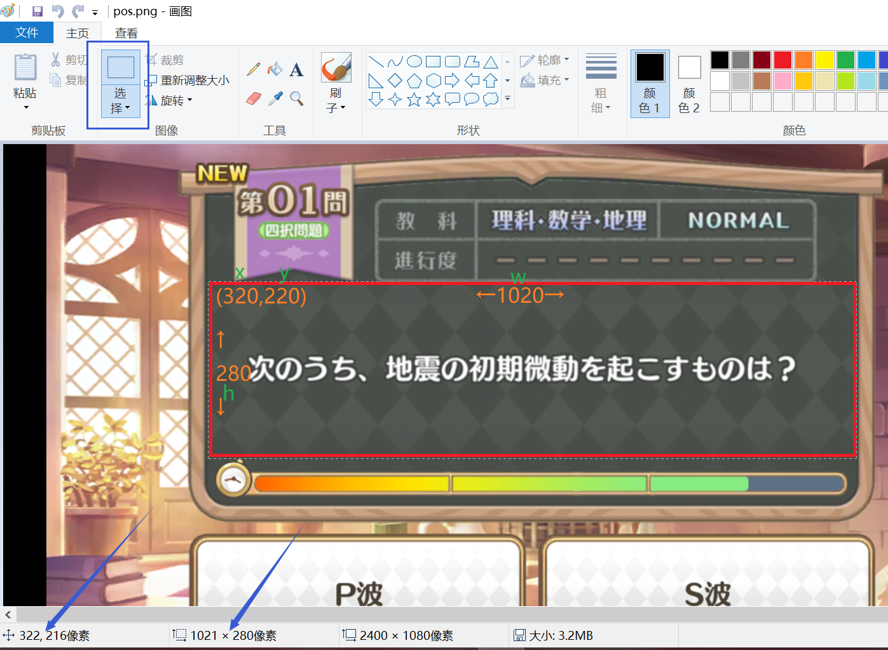

# ASMOCR
公主连结日服魔法学院活动小游戏辅助 [演示(b站)](https://www.bilibili.com/video/BV1tm4y1T7Dr)

## 用法
- 安装[python](https://www.python.org/downloads/release/python-31011/) 推荐3.10 装Windows installer (64-bit) 勾选环境变量
- 自己想办法把pip切换成国内源 然后```pip install -r requirements.txt```
- 自己装好安卓usb驱动以及adb 手机上打开开发者模式打开usb调试 运行```adb devices```能看到自己的设备
- 手机上游戏内截个图 传电脑上拿画图打开 文件编辑器打开```run.py```修改几个参数

- 最后```python run.py```手机上可能会有usb调试弹窗 点允许

## 可以参考的相关教程
- [python安装和切换国内源](https://sra.stysqy.top/guide/#python%E7%9A%84%E5%AE%89%E8%A3%85)
- [ADB相关](https://www.xda-developers.com/install-adb-windows-macos-linux/)
