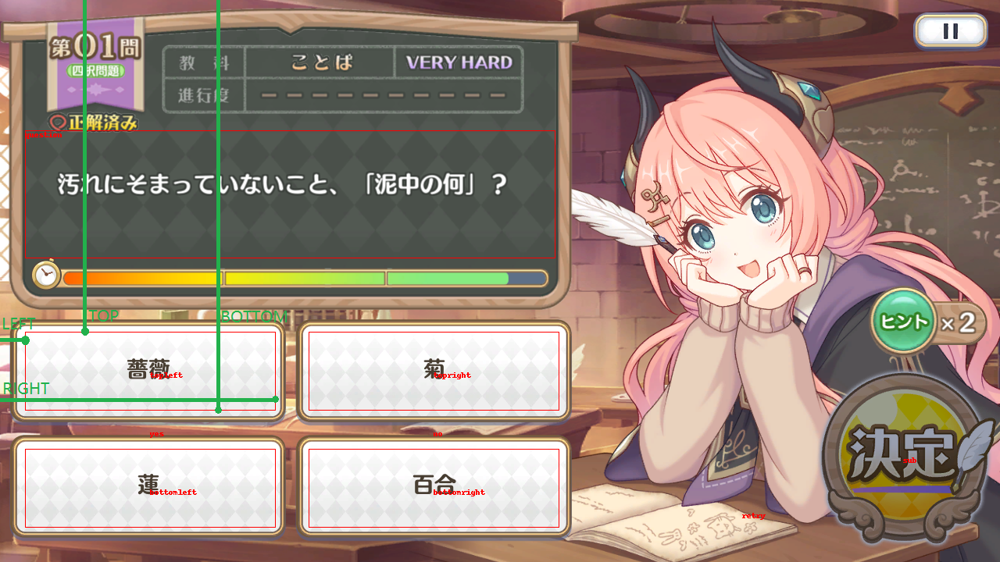

# ASMOCR
公主连结日服魔法学院活动小游戏辅助 [演示(b站)](https://www.bilibili.com/video/BV1tm4y1T7Dr)

## 用法
- 直接去[release](https://github.com/paulzzh/ASMOCR/releases)下载 完整解压出来
- 打开公主连结dmm客户端
- 双击```ASMOCR.exe```

## 注意
- 程序受windows缩放影响 如果系统启用缩放需要调整兼容性设置
- 
- 源码运行需要找到```python.exe```调整

## 自定义配置文件
- 有时候不在dmm端运行 这个时候打开```config.json```
- 窗口标题为模糊匹配窗口标题(?) 总之是要拿句柄 比如可以填```雷电模拟器```
- bbox指(left,top,right,bottom)
- 查看```dmm.png```参考填写
- 分别是 矩形 左边距窗口左侧 上边距窗口上侧 右边距窗口左侧 下边距窗口上侧 的距离
- 
- 程序运行后会生成一张对应窗口名的选框图 用于debug 可查看选框是否正确

## 源码运行 普通人不需要看
- 安装[python](https://www.python.org/downloads/release/python-31011/) 推荐3.10 装Windows installer (64-bit) 勾选环境变量
- 自己想办法把pip切换成国内源 然后```pip install -r requirements.txt```
- 下载[PaddleOCR-json](https://github.com/hiroi-sora/PaddleOCR-json/releases)并解压 修改文件夹名为PaddleOCR-json
- 打开公主连结dmm客户端
- 最后```python run.py``` 进入小游戏
- 可以参考的相关教程 [python安装和切换国内源](https://sra.stysqy.top/guide/#python%E7%9A%84%E5%AE%89%E8%A3%85)

## 感谢
- PaddleOCR-json https://github.com/hiroi-sora/PaddleOCR-json
- PaddleOCR https://github.com/PaddlePaddle/PaddleOCR
- py打包编译工具Nuitka https://github.com/Nuitka/Nuitka